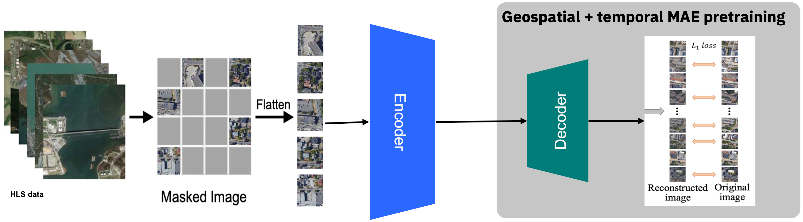

### Model and Inputs
Prithvi is a first-of-its-kind temporal Vision transformer (ViT) pretrained by the IBM and NASA team on continental US Harmonised Landsat Sentinel 2 (HLS) data. Particularly, the model adopts a self-supervised encoder developed with a ViT architecture and Masked AutoEncoder learning strategy, with a Mean Squared Error (MSE) as a loss function. The model includes spatial attention across multiple patchies and also temporal attention for each patch. 

The model expects remote sensing data in a video format (B, C, T, H, W). Note that the temporal dimension is very important here and not present in most 
other works around remote sensing modeling. Being able to handle a time series of remote sensing images can be very helpful to a variety of downstream tasks. The model can also handle static image which can be simply fed into the model with T=1.

### Pre-training
The model was pre-trained with NASA's HLS2 L30 product (30m granularity) from Continental United States for the year 2017. The bands that were used are the following: 

* Blue
* Green
* Red
* Narrow NIR
* SWIR 1
* SWIR 2

### Code
The model follows the [original mae repo](https://github.com/facebookresearch/mae) with some modifications including:
1. replace 2D patch embed with 3D patch embed;
2. replace 2D positional embed with 3D positional embed;
3. replace 2D patchify and unpatchify with 3D.

### Model weights
The model weights are available [here](https://huggingface.co/ibm-nasa-geospatial/Prithvi-100M/blob/main/Prithvi_100M.pt).
